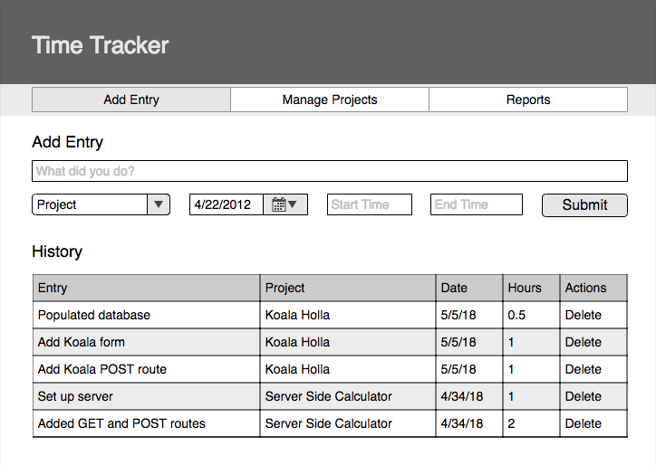
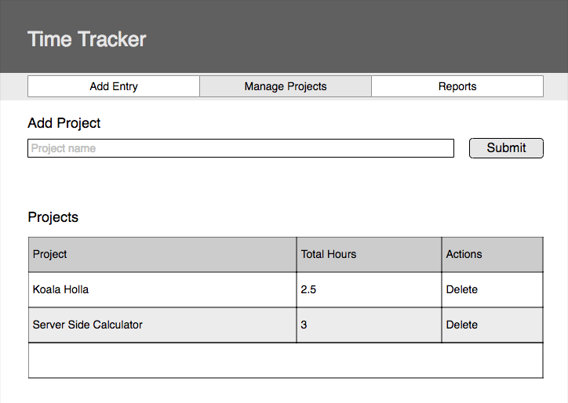
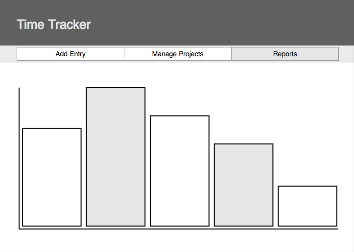

### SQL DATABASE SETUP
```SQL
CREATE TABLE "entry" (
"id" SERIAL PRIMARY KEY,
"line_item" VARCHAR (80) NOT NULL,
"description" VARCHAR (200) NOT NULL,
"project" VARCHAR (100) NOT NULL,
"date" DATE NOT NULL,
"hours" INTEGER
);

CREATE TABLE "project" (
"id" SERIAL PRIMARY KEY,
"name" VARCHAR (100) NOT NULL,
"total_hours"  INT
);
```

# Time Tracker Project

> NOTE: Do not fork this repository. Instead, create your own repository from scratch.

Trello Board: [https://trello.com/b/WUa7rOxR/time-tracker-sample](https://trello.com/b/WUa7rOxR/time-tracker-sample)

## Features
[x] - View navigation
[x] - Add projects by name
[x] - Track time to projects (task name, date, start time and end time)
[x] - Display a history of all time entries
[x] - Delete existing entries
[x] - Show total hours worked next to each project on the project page

### Wireframes

#### Add Time Entry View



#### Manage Projects View



### Database

Start with two tables **projects** & **entries**. When base features are complete, add more tables as needed for stretch goals.

## Stretch Goals

- Ability to edit entries or projects
- Angular Material for design
- Display a chart showing the total number of hours worked for each project
- Ability to select start and end dates to influence what appears on the chart
- Feel free to deviate from this list and add features of your own

### Wireframes



